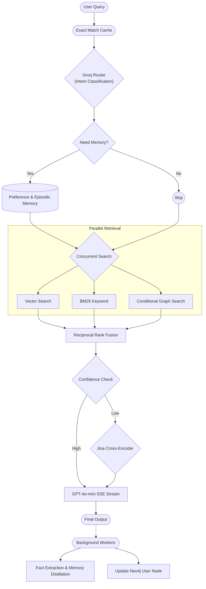

# 7. Memory & Retrieval Optimization Architecture

As the platform evolved, we discovered that retrieval latency was no longer dominated by Vector Search or Graph Search, but instead by unconditional memory loading and semantic cache lookups. To achieve production-grade responsiveness, we redesigned the orchestration layer following Mem0-inspired principles.

## 7.1 Router-First Architecture

**Replaced:** Eager Memory Loading
**Upgraded To:** Router-First Conditional Memory Retrieval

**Reason:**
Initially, every request executed sequentially:
`Semantic Cache -> Load Preference Memory -> Load Episodic Memory -> Contextualization -> Router -> Retrieval`

This caused 70–80% of total latency to be spent loading memory, even for simple technical queries that did not require user context.

We redesigned the workflow:
`User Query -> Groq Router -> Intent Classification -> Need Memory? -> Selective Memory Retrieval -> Hybrid Search -> Generator`

Memory is now treated as an **optional capability** rather than a mandatory stage.

---

## 7.2 Intent-Aware Memory Controller

**Added:** Memory Controller Node
The Router now returns structured JSON predicting whether memory is actually required for the current interaction:

```json
{
  "intent": "technical",
  "need_memory": false,
  "memory_type": null
}
```

**Possible intents:** `technical`, `greeting`, `conversational`, `followup`, `personal`, `mixed`
*Only `personal` and `followup` queries trigger memory retrieval.*

| Query | Intent | Memory |
| :--- | :--- | :--- |
| What is RAG? | technical | No |
| Explain HNSW | technical | No |
| Continue our project | followup | Yes |
| What language do I prefer? | personal | Yes |
| Summarize our chat | conversational | Yes |

This dynamically bypasses the memory pipeline, dramatically reducing unnecessary SQL lookups.

---

## 7.3 Parallel Retrieval Pipeline

**Replaced:** Sequential Retrieval
**Upgraded To:** Concurrent Async Retrieval

**Previously:**
`Vector Search -> BM25 Search -> Neo4j Search -> RRF`

**Now:**
All three retrievers execute concurrently across multiple threads/async loops, minimizing overall latency. The total retrieval time is now only as slow as the single slowest database.

---

## 7.4 Conditional Graph Retrieval

**Added:** Graph Query Gating
Graph retrieval is an incredibly expensive operation and unnecessary for simple definitional questions.

| Query | Graph Search |
| :--- | :--- |
| What is RAG? | No |
| Explain BFS | No |
| Explain relationship between Customized Options and custom_variable_classes | Yes |

Neo4j traversal now only executes when entity relationships are explicitly required by the user's query context. This reduces graph overhead significantly.

---

## 7.5 Hot Preference Cache

**Replaced:** SQL Lookup Per Request
**Upgraded To:** In-Memory LRU Cache

Preference Memory is cached directly in server RAM:
```json
{
    "user_123": {
        "formatting": "bullet points",
        "language": "Python"
    }
}
```
**TTL:** 15–30 minutes
**Benefits:**
- RAM lookup <1 ms
- Avoids repeated Supabase queries
- Lowers latency and database load

---

## 7.6 Lazy Episodic Memory

**Replaced:** Always Loading Conversation Summaries
**Upgraded To:** On-Demand Episodic Retrieval

**Triggers:** `continue`, `previous`, `summarize`, `remember`, `our discussion`, `my project`

Technical queries bypass episodic memory entirely. This prevents prompt token inflation and reduces SQL latency for the vast majority of interactions.

---

## 7.7 Dynamic Cross-Encoder Reranking

**Added:** Confidence-Aware Reranking
**Current threshold:** `score >= 0.15`

**Optimization:**
If the Reciprocal Rank Fusion (RRF) algorithm returns highly confident results (e.g., exact matches spanning both BM25 and Vector search), the Jina Cross-Encoder reranker is skipped entirely.

**Workflow:**
`RRF -> High Confidence? -> Yes (To Generator) / No (To Jina Reranker)`
This saves ~100–200 ms per request and bypasses costly API calls.

---

## 7.8 Selective Graph Expansion

During ingestion, chunks are enriched with metadata:
```json
{
  "entities": [...],
  "section": "...",
  "parent_chunk": "..."
}
```

**During retrieval:**
1. Vector Search identifies top chunks.
2. Entities are extracted from those specific chunks.
3. Neo4j traverses *only* those targeted entities.

Instead of traversing the whole graph unconditionally:
```cypher
MATCH (n)-[r]-(m)
WHERE n.name IN $entities
RETURN ...
LIMIT 3
```
This minimizes graph payload size and forces relational accuracy.

---

## 7.9 Background Memory Distillation

Memory writes never block generation.

**Pipeline:**
`Response Stream -> Background Thread -> Extract Facts -> Distill Conversation -> Update Preference Memory -> Update Episodic Memory -> Update Neo4j User Node`

This follows core Mem0 principles and guarantees that memory storage has absolute zero impact on user-facing latency.

---

## 7.10 Retrieval Philosophy

**Heavy Ingestion**
During document ingestion (done once):
- Parent-child chunking
- Coreference resolution
- Entity extraction
- Knowledge graph construction
- Metadata enrichment

Expensive processing is acceptable because ingestion happens once per document.

**Lightweight Retrieval**
At runtime (executed thousands of times):
- Router
- Selective memory
- Vector Search
- BM25
- Conditional Graph Search
- RRF
- Dynamic Reranking

Retrieval remains perfectly lightweight to guarantee sub-second UX.

---

## 7.11 Production Architecture Map


