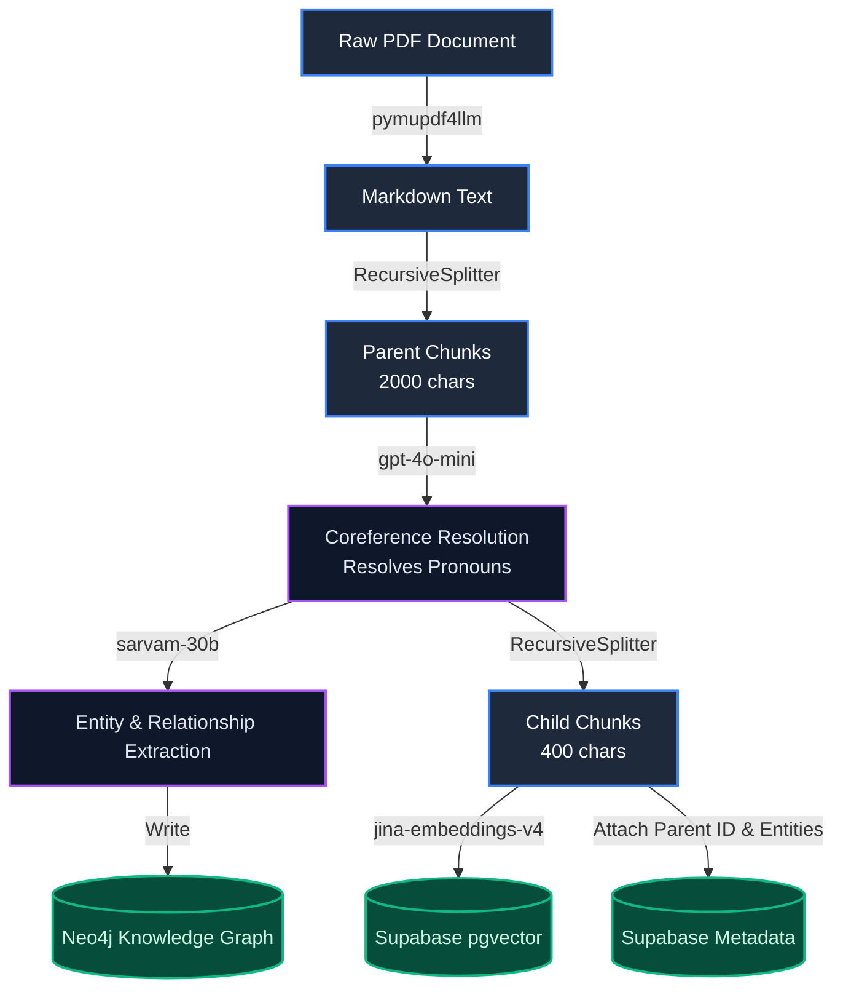

# CognitRAG.ai - System Architecture Documentation

## Core Philosophy

CognitRAG.ai is built on a fundamental design principle: **Neo4j is not a primary retriever.**

In traditional GraphRAG systems, graph outputs are directly injected into the LLM context alongside semantic chunks. This leads to "Graph Poisoning," where a massive dump of relationships buries the actual context, destroying the LLM's attention span and causing token limits to overflow. 

CognitRAG solves this by implementing **Confidence-Gated Multi-Source GraphRAG**. The graph is treated as a secondary relationship expander that only fires when triggered by high-confidence signals. More importantly, any graph relationships retrieved must *compete* with standard text chunks through a strict Cross-Encoder reranking stage before reaching the Generator. 

---

## 1. The Evolution of Chunking: Why We Changed Strategies

In early iterations of this system, we experimented with both structural and semantic splitters before settling on our current robust architecture.

* **Why we dropped `MarkdownHeaderTextSplitter`:** 
  The standard LangChain markdown splitter relies on strict hierarchical rules. We discovered a fatal flaw: if the PDF parser extracts two adjacent headers of the same level (e.g., `## Header A` immediately followed by `## Header B`) with no paragraph text in between, the splitter registers the first header as an "empty section." It silently deletes the first header from memory, causing **permanent data loss** and failed queries.
  
* **Why we bypassed `SemanticChunker`:** 
  While mathematically elegant (splitting purely on embedding topic shifts), semantic chunkers ignore the structural hierarchy of technical manuals and are computationally expensive during ingestion.
  
* **The Solution:** We adopted a **Coreference-Enhanced Recursive Pipeline**. We use purely character-based chunking to guarantee zero data loss, and rely on an LLM to mathematically "glue" the context back together via Coreference Resolution before saving to the database.

---

## 2. Ingestion & Chunking Architecture

The current multi-stage ingestion pipeline is designed to eliminate data loss and massively optimize the small chunks for vector search.

### Ingestion Workflow Diagram



### Ingestion Steps Explained
1. **Raw PDF Parsing**: `pymupdf4llm` extracts text, lists, and tables into raw Markdown natively on the local server.
2. **Recursive Parent Chunking**: The text is chopped into 2000-character blocks purely by character count. This brute-force approach guarantees that no headers or edge cases are ever silently deleted.
3. **Coreference Resolution**: The Parent chunk is sent to an LLM (`gpt-4o-mini`) which rewrites the text to resolve pronouns (e.g., replacing "It is disabled by default" with "The custom_variable_classes option is disabled by default"). This step is the secret weapon of the pipeline.
4. **Entity Extraction**: The resolved Parent chunk is sent to `sarvam-30b` to extract explicit graph nodes and relationships for Neo4j.
5. **Child Chunking**: The resolved Parent chunk is chopped into tiny 400-character Child chunks. Because pronouns were resolved in Step 3, every single tiny chunk is packed with highly-searchable, explicit nouns.
6. **Multi-Database Storage**: The Child chunks are embedded and saved to Supabase for hyper-precise vector searching, and secretly tagged with their Parent ID so the large context block can be reconstructed at query time.

---

## 3. Query & Retrieval Architecture

At query time, the system uses a **10-Stage Corrective RAG (CRAG)** pipeline powered by LangGraph to aggressively filter out noise and ensure high-fidelity answers.

### Query Workflow Diagram

```mermaid
graph TD
    A[User Query] --> B{Semantic Cache Check}
    B -- Hit > 95% --> C[Return Cached Generation]
    B -- Miss --> D[Hybrid Retrieval]
    
    D -->|pgvector| E1[Vector Search]
    D -->|FTS| E2[Keyword Search]
    E1 --> F[Reciprocal Rank Fusion]
    E2 --> F
    
    F --> G[1st Cross Encoder Rerank<br/>jina-reranker-v2]
    
    G -- High Confidence Signals --> H[Neo4j Graph Expansion]
    G -- Low Confidence --> L{CRAG Router}
    
    H -->|Targeted 1-Hop| I[Graph Sentences]
    I --> J[Context Fusion]
    G --> J
    
    J --> K[2nd Cross Encoder Rerank]
    K --> M[Generator<br/>gpt-4o-mini]
    
    L -- Fallback --> N[Rewrite Query via LLM]
    N --> D

    classDef input fill:#1e293b,stroke:#3b82f6,stroke-width:2px,color:#f8fafc;
    classDef rerank fill:#450a0a,stroke:#ef4444,stroke-width:2px,color:#fee2e2;
    classDef graph fill:#172554,stroke:#3b82f6,stroke-width:2px,color:#dbeafe;
    classDef search fill:#064e3b,stroke:#10b981,stroke-width:2px,color:#d1fae5;
    classDef llm fill:#4c1d95,stroke:#8b5cf6,stroke-width:2px,color:#ede9fe;
    
    class A,B,C input;
    class G,K rerank;
    class H,I,J graph;
    class D,E1,E2,F search;
    class L,N,M llm;
```

### Query Steps Explained
1. **Semantic Cache Check**: If the new query is semantically identical (95% similarity) to a previously cached query, the entire pipeline is bypassed for 0ms latency.
2. **Hybrid Retrieval**: Parallel searches run across **Supabase Vector Search** and **BM25 Keyword Search**. The results are mathematically merged using Reciprocal Rank Fusion (RRF).
3. **Precision Filter (1st Rerank)**: The fused chunks pass through the `jina-reranker-v2` cross-encoder. Chunks scoring below `0.15` are ruthlessly dropped.
4. **Metadata Entity Voting**: `ChunkMetadata` nodes corresponding to the surviving chunks are queried in Neo4j to build an authoritative list of `candidate_entities`.
5. **Conditional Graph Expansion**: If the signals are strong, a strict 1-hop Neo4j traversal retrieves relationships for *only* the candidate entities to prevent graph explosion.
6. **Context Fusion & 2nd Rerank**: The graph relationships are translated into natural language sentences, merged with the text chunks, and undergo a **second cross-encoder rerank**. 
7. **Generation**: The surviving, highly-curated context is streamed to the lightning-fast **gpt-4o-mini** model to generate the final, hallucination-free answer.
8. **CRAG Fallback**: If retrieval yields zero relevant chunks at Step 3, the Router routes the query to a "Rewrite" node, which reformulates the question and tries again.

---

## 4. Background Memory Subsystems

While the primary retrieval pipeline operates, localized background tasks handle long-term memory:
- **Fact Extraction**: User-specific facts and preferences are extracted by an LLM asynchronously after each generation.
- **Rolling Conversation Summaries**: Once the chat history exceeds 4 turns, older messages are dynamically summarized by the LLM into a rolling background context to preserve context window limits.

---

## 5. Model Stack

The architecture leverages a specialized combination of models, each optimized for a specific task within the pipeline.

### Ingestion Models
1. **`gpt-4o-mini`** (via GitHub Models): Used for **Coreference Resolution**. It rewrites large 2000-character parent chunks to resolve ambiguous pronouns, ensuring no context is lost when chunks are later divided.
2. **`sarvam-30b`** (via Sarvam AI): Used for **Entity & Relationship Extraction**. It analyzes the pronoun-resolved parent chunks to explicitly extract graph nodes and relationships for Neo4j.
3. **`jina-embeddings-v4`** (via Jina AI): Used for **Vector Embedding**. It translates the final 400-character child chunks into dense numerical vectors for storage and search in Supabase (pgvector).

### Query Models
1. **`jina-embeddings-v4`** (via Jina AI): Used for **Query Embedding**. Converts the user's live question into a dense vector for Hybrid Retrieval.
2. **`sarvam-105b`** (via Sarvam AI): Used as the **CRAG Router** (and MLflow Evaluator Judge). It acts as the brain at the start of the pipeline to analyze user intent, decide if graph memory is needed, and extract targeted entities.
3. **`jina-reranker-v2`** (via Jina AI): Used as a **Cross-Encoder Precision Filter**. It runs twice: first to filter out irrelevant chunks post-retrieval, and second to rerank the fused text and graph sentences.
4. **`sarvam-30b`** (via Sarvam AI): Used as the **Graph Expansion Decider**. A fast model that reviews highly-ranked chunks to make a strict binary decision on whether Neo4j traversal is necessary, preventing graph poisoning.
5. **`gpt-4o-mini`** (via GitHub Models): Used as the **Final Generator**. Generates the final, hallucination-free answer from the pristine, curated context.

---

## 6. Evaluation Results

The CognitRAG system was rigorously evaluated using MLflow and a bulletproof Instructor Judge (`sarvam-105b`). The evaluation dataset consisted of 10 domain-specific questions derived from the *PostgreSQL 14 Manual (Chapter 16. Server Run-time Environment)*. 

The evaluation metrics achieved a perfect score, demonstrating the robustness of the Multi-Source GraphRAG architecture:
- **Faithfulness:** 1.0 (100%) - All generated answers were strictly grounded in the retrieved context.
- **Relevance:** 1.0 (100%) - All answers directly addressed the core intent of the questions.
- **Context Accuracy:** 1.0 (100%) - The retrieval pipeline successfully fetched the correct source chunks for every query.

### Evaluation Dataset

| # | Question | Expected Answer |
|---|----------|-----------------|
| 1 | What is the default setting for regex_flavor in PostgreSQL? | The default is advanced. |
| 2 | In PostgreSQL 8.0.0, what is the default behavior of default_with_oids? | In PostgreSQL 8.0.0, default_with_oids defaults to true, meaning CREATE TABLE includes an OID column. |
| 3 | What does the block_size parameter determine and what is its default value? | It shows the size of a disk block. The default value is 8192 bytes. |
| 4 | How do you configure PostgreSQL to support 64-bit-integer dates and times? | By configuring with --enable-integer-datetimes when building the server. |
| 5 | What is the default value of max_identifier_length? | The default max_identifier_length is 63. |
| 6 | What is the purpose of the custom_variable_classes option? | It specifies one or several class names to be used for custom variables used by add-on modules. |
| 7 | What does setting zero_damaged_pages to true accomplish? | It causes the system to report a warning, zero out the damaged page, and continue processing instead of aborting the command, destroying all rows on the damaged page but allowing retrieval from undamaged pages. |
| 8 | What is the most important shared memory parameter and what error might indicate it is exceeded? | SHMMAX is the most important parameter. An error message from shmget like Invalid argument is likely if this limit has been exceeded. |
| 9 | How many semaphores can be in a set for PostgreSQL, as defined by SEMMSL? | The SEMMSL parameter must be at least 17 for PostgreSQL. |
| 10 | How can you change the memory overcommit behavior in Linux 2.6 to strict overcommit mode? | By using sysctl -w vm.overcommit_memory=2 or placing an equivalent entry in /etc/sysctl.conf. |
